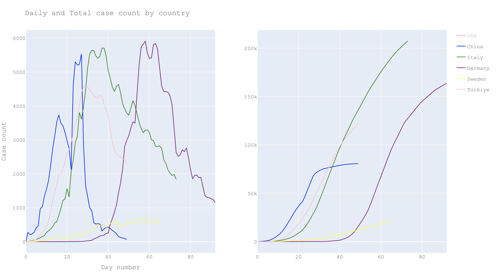
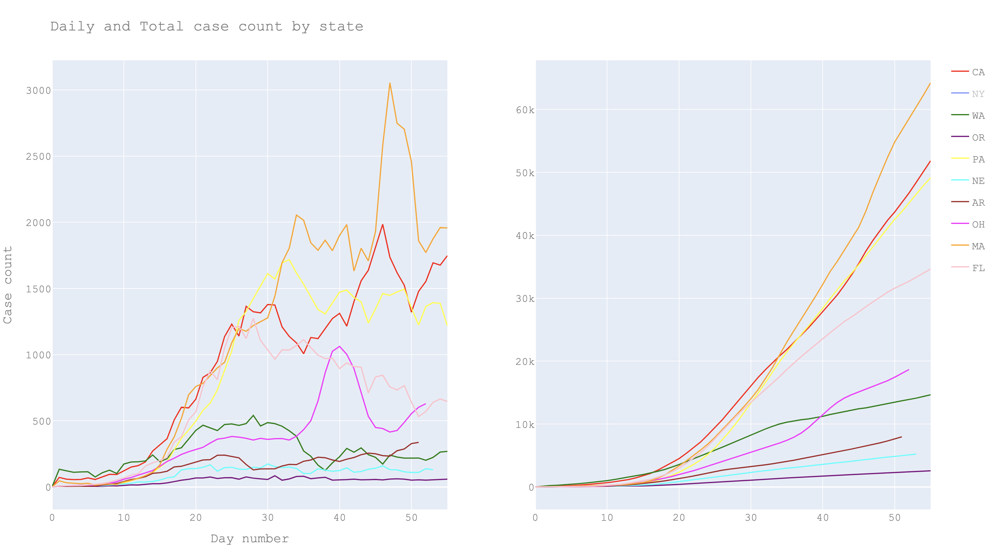

This analysis was inspired by the work [here](https://github.com/odtboun/kovidor). The linked project looks at the total and daily number of covid-19 cases by country to understand if the country is still on an increasing pandemic trajectory or deviating from it to recovery as has been achieved by some countries.
Using the same idea, in this project we look at the status of US states, and compare them to overall country level trajectories of other countries.
The code for the analysis can be found here `/case_counts/us_states_analysis.py`.

For this analysis, I will focus on a sample of countries: China, Germany, Italy, Turkey, Sweden, Norway; also handful of US states. However, the code will be able to generate the analysis for any country or state.

Here's country by country total and daily case counts by day:

Since USA is in a different scale, lets look at the countries without USA:

Here's the same graph for select US states:

Since NY is definitely an outlier case, lets look at the states without NY:

### Running the analysis
`pipenv run python case_counts/us_states_analysis.py`
