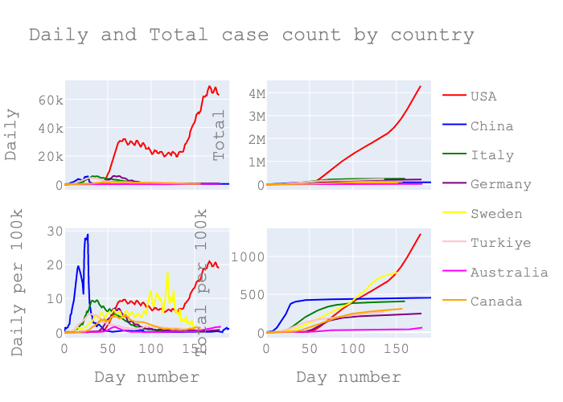

This analysis was inspired by the work [here](https://github.com/odtboun/kovidor) and [here](https://aatishb.com/covidtrends/). The linked project looks at the total and daily number of covid-19 cases by country to understand if the country is still on an increasing pandemic trajectory or deviating from it to recovery as has been achieved by some countries.
Using the same idea, in this project we look at the status of US states, and compare them to overall country level trajectories of other countries.
The code for the analysis can be found here `/case_counts/us_states_analysis.py`.

I will also use estimated population of US states as of 2019 from [here](https://www.census.gov/data/tables/time-series/demo/popest/2010s-state-total.html). And most recent Word Population estimates by country from [here](https://population.un.org/wpp/Download/Standard/Population/).

For this analysis, I will focus on a sample of countries and a handful of US states. However, the code will be able to generate the analysis for any country or state. With this analysis, I wanted to look at US state by state situation as compared to some countries that have been successful at containing this pandemic.

## Countries
Here's country by country daily and total case counts by day number:

The top row shows the pure counts of cases on a daily and cumulative basis.
On this row it's hard to compare different countries without removing US since it is in a different scale.
In the second row the numbers are normalized by total population size to be able to compare them easily.
Note that, for China, I actually used population size for Wuhan not all of China.
The normalized counts in these graphs helps us easily see similarities and differences.
Both US and Sweden got to the peak later in the timeline than the others, this could be due to limited testing early on at least in the US. These 2 countries seem to be still in an increasing trajectory not yet flattened the curve as of July 2020.

## States
Here's the daily and total case counts by day number for select US states. Note that the NY case counts looks very similar to most of the country graphs above, a sudden increase of daily cases, after about a month, the new case counts have been decreasing. However, NY has seen much higher numbers from all other states at the beginning. Since CA, NY has higher population, it's better to compare the states in the normalized counts in the second row of this graph.
AZ, FL, NE and CA were able to keep the numbers low in the first 3 months, however they have been increasing rapidly similar to early trends of many countries after the 100 day mark.
In fact, other than NY and MA, all the other states in this graph seem to be in an increasing trajectory as of July 2020.

Below figure combines US states and some countries in the same graph, using the normalization via population.
Here the trajectory of total cases shows that most US states haven't been able to contain the virus as well as the countries in this list. Further, even though NY and MA looks to be flattened the curve when compared to other US states, they don't yet seem to reach the levels that was attained by China, Germany, Italy or Australia.

## Logarithmic scale and covidor
Lets combine the daily and total case counts in one graph and see the comparison of states and countries a bit better. In this graph we can see it better that some countries and states have been in a lower trajectory from the beginning. However, the countries and states in higher trajectories have been able to lower the daily case counts to much lower numbers showing a clear deviation from the steady increase they have been. While CA, MA, OH has been on a lower trajectory, they still seem to be on that same trajectory.

### Running the analysis
`pipenv run python case_counts/us_states_analysis.py`
