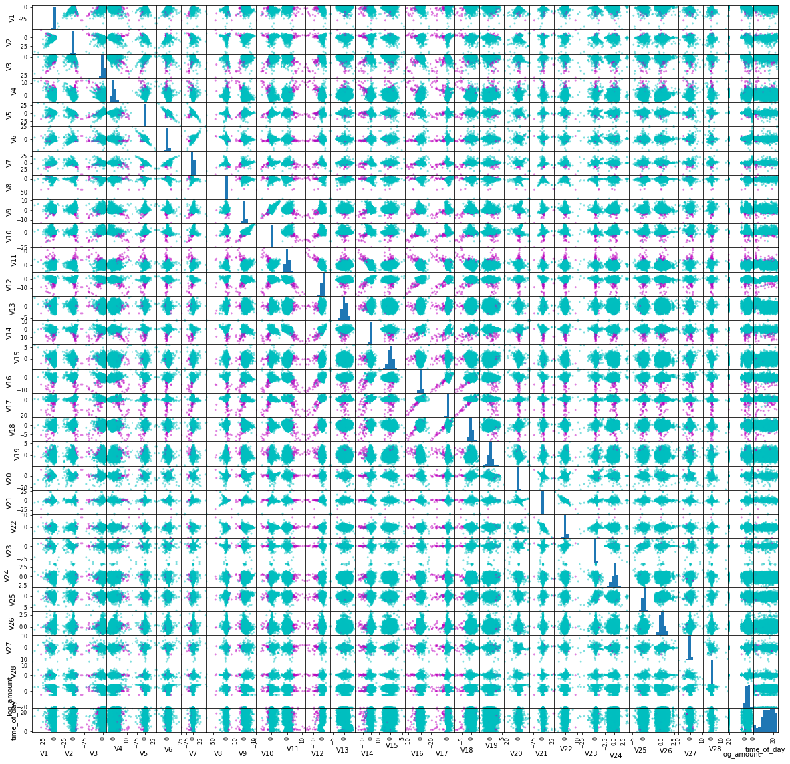
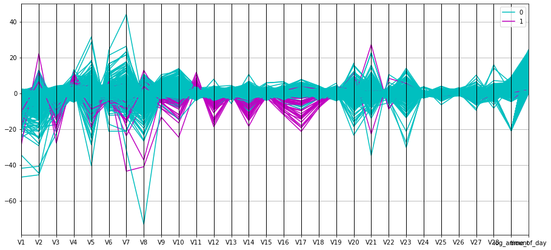
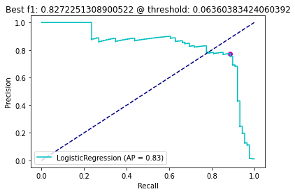
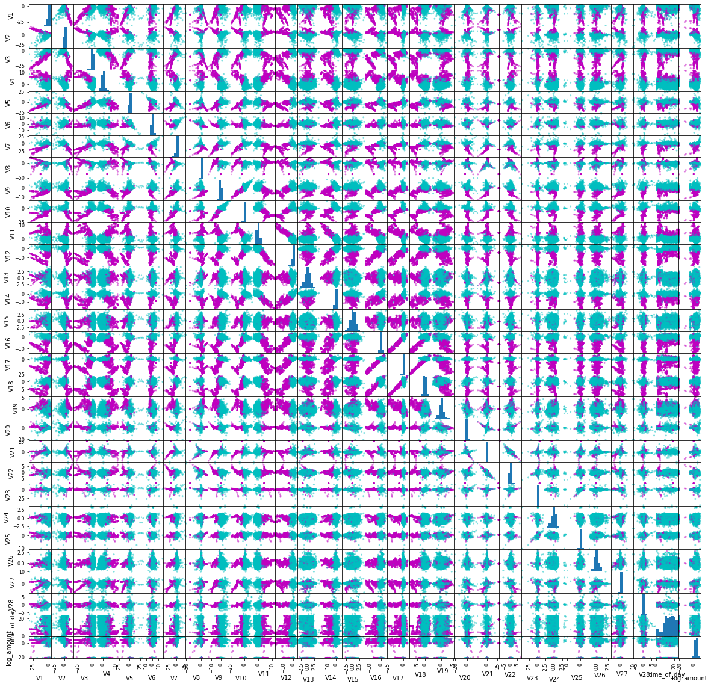
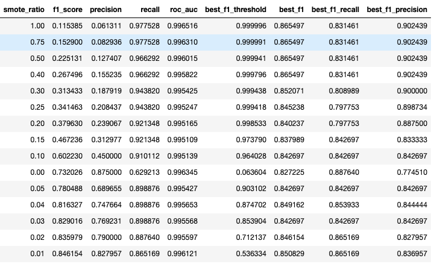

# Credit Card Fraud Detection
## Data Analysis
This is an analysis for the data from [this kaggle set](https://www.kaggle.com/mlg-ulb/creditcardfraud).
In this dataset we have 284807 rows, all 31 columns have associated values for each row.
Only 492 (0.17%) of all rows are positive for fraud.
This is highly unbalanced data and f1 score is probably good metric to start with for classification.
Another option to consider for the metric is area under the precision-recall curve.
Both of these metrics are relevant when we care about positive class, and there is a class imbalance.
For this analysis we'll stick to f1-score.

From the summary statistics and histograms we see that PCA features have similar scale,
while Time and Amount attributes have a different scale.
Transforming Time attribute from seconds to hours gives us a similar scale.
Even though we only have 2 days of data, there seems to be a cycle on number of transactions happening on a daily basis.
We will include this cycle information and further scale the Time to be in [0,24) range.

For Amount feature, we will use log transform to get on a similar scale.
However, there are some values that are 0, so we'll add a small positive number to avoid division by zero.

Below is the scatter matrix of all variables with a random sample from data, where magenta color shows positive class.



In this graph, we can see that some PCA features are good at separating the classes in almost all combinations
with other features, V9, V10, V11, V12, V14, V16, V17 and V18.
Since we can see some level of linear separation, Logistic Regression for this classification will likely be a good starting point.
Below parallel coordinates plot from the same sample, further shows similar insight into the value of the same features above.
We can also see some outliers easily in this view.



*Question*: why are there fraud events where the amount is $0?
Are these inherently different kind of fraud events then the others? Could they be default values for NaN?
There are almost 10X more fraud events with amounts $0 (1.48%) vs non-zero (0.16%).

## Modeling
For baseline, we'll start with Logistic Regression with defaults from sklearn.
This model already gives a pretty good starting point:

```
  F1 score: 0.7320261437908497
  ROC AUC: 0.9963446975060996
  Precision: 0.875
  Recall: 0.6292134831460674
```

A few things to note.
The model was able to identify fraud cases even with class imbalance,
so we don't need to force weighting to the model.
Even though F1 score is not very high, we do have a model with high ROC.
Looking further into the precision-recall curve tells us we could set a different threshold then 0.5
to increase recall, without lowering precision too much.
So we can tune this threshold value to get a better F1 score and overall better fitting model.



The threshold with best f1 score is 0.06360383424060392. This is a pretty low threshold,
and we are getting the lift from recall increase while also increasing our false positives.
With this threshold here are the metric values:

```
  F1 Score: 0.8272251308900522
  Precision: 0.7745098039215687
  Recall: 0.8876404494382022
```

F1 score assumes, we are ok to make the trade-off between identifying more fraud cases while we get more false positives.
Also note that the amount of fraud is low, so our false positive rate will be relatively low still.
Having said that, if for the business use case, the value of identifying fraud is lower than the potential loss
from false positive case we might want to update f1 score to be a weighted mean reflecting this difference
to find a better threshold that fits business case.
For business use case, it might be hard to define this trade-off numerically.
In that case, we could still use a couple thresholds to make decisions in slightly different ways.
For example, we can put the results of the model into multiple buckets: high risk, low risk and medium.
Here, high risk bucket could be the ones that are automatically labeled as fraud, for this bucket we probably want a high precision, and we can choose the threshold that gives us the highest precision (or highest while certain recall is achieved).
The medium risk bucket would be the ones that are predicted to be fraud with the above threshold which are not already in the high risk bucket. These fraud items would need a second look and require an approval from a human.
The rest of the items would be considered low risk and only randomly selected few would go through a human check.
This human in the loop approach would not only be good for business case, but also give us new labeled data to improve the model.

Even though this is a good starting model, we can always improve. One relevant idea is trying over-sampling,
since we have such limited number of positive cases, increasing this number might help the model learn to separate fraud better.
One such technique is called SMOTE (Synthetic Minority Oversampling Technique), I will use
[imbalanced-learn](https://imbalanced-learn.readthedocs.io/en/stable/generated/imblearn.over_sampling.SMOTE.html)
library to over-sample for fraud cases, before I fit a logistic regression model.

Here is a sample from the training data after applying SMOTE and increasing the fraud cases to be 5%.



Here the trends of the fraud data is much more visible then the sample we had before.
Training logistic regression on this new training data show immediate improvement in F1 score.

```
  F1 score: 0.7804878048780488
  ROC AUC: 0.9954271944054925
  Precision: 0.6896551724137931
  Recall: 0.898876404494382
```

For this model, the .5 threshold seems low, since we start with higher recall and lower precision.
The best F1 score has a threshold of 0.9031020795733965 with higher f1 score than before:

```
  F1 score: 0.842696629213483
  ROC AUC: 0.9954271944054925
  Precision: 0.842696629213483
  Recall: 0.842696629213483
```

We can tune for amount of over-sampling, by trying a range of values and finding the best fitting one.
Below table shows the amount of Synthetic oversampling along with the metrics of logistic regression using this data:



The highest F1 score with default threshold is achieved by using an over-sampling ratio of 1% (i.e. only 1% of training is fraud).
The top 5 default F1 score comes from using SMOTE to increase fraud cases up to 5%.
This makes sense, since we have very limited amount of fraud data, when we introduce more and more synthetic
examples, we are amplifying the noise in this data.
Another thing to note is as we increase the number of synthetic examples, the best possible f1 score for the over-sampled case gets slightly better. However, for most of these cases, the threshold also becomes very high (> .99).
For these reasons, I will only use up to 5% over-sampling in fraud data.
